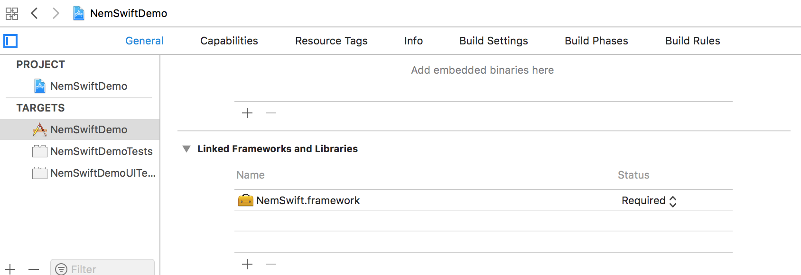
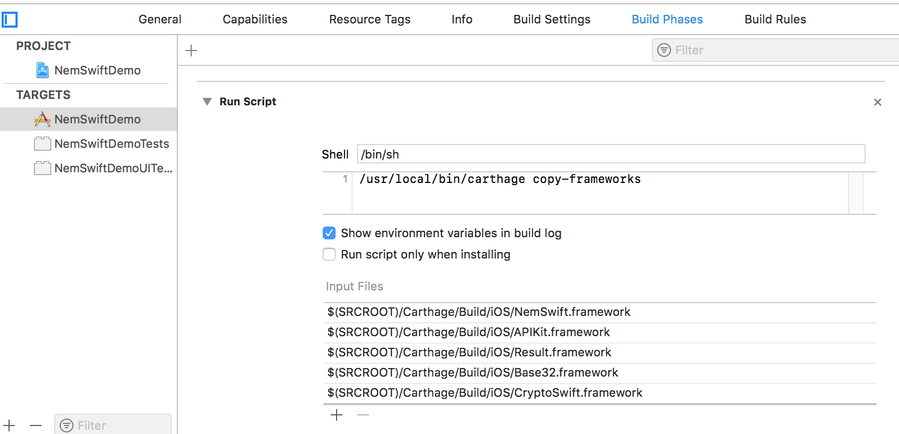

Read this in other languages: [English](README.md), [日本語](README.ja.md)

# nem-swift

nem-swift is a client library for easy use of NEM(New Economy Movement) API.

This library wraps HTTP requests to NIS(NEM Infrastructure Server) and HTTP responses from NIS.

This library also provides crypt related utilities like key pair generation signing and verifying.

## Sample

Sample projects are in [NemSwiftDemo](NemSwiftDemo) directory.

## Installation

Use Carthage or Cocoapods.

### Carthage

1. Insert `github "ryuta46/nem-swift"` to your Cartfile.
2. Run `carthage update`.
3. Add "NemSwift.framework" to Linked Frameworks and Libraries  
    TARGETS -> YourTarget -> Linked Frameworks and Libraries  
    Press "+" -> Add Other... -> Select "NemSwift.framework" in Carthage/Build/iOS

    

4. Add Run Script in Build Phases  
    Build Phases -> Press "+" -> New Run Script Phase  
    Shell `/bin/sh`  
    Script `/usr/local/bin/carthage copy-frameworks`  
    Add "NemSwift.framework", "APIKit.framework", "Result.framework", "Base32.framework" and "CryptoSwift.framework" to input file

    

### Cocoapods

## How to use

### Setup

#### Configure ATS

If you want to access to NIS with HTTP (not HTTPS) protocol, configure ATS (App Transport Security) in Info.plist file.

See [ATS Configuration Basics](https://developer.apple.com/library/archive/documentation/General/Reference/InfoPlistKeyReference/Articles/CocoaKeys.html#//apple_ref/doc/uid/TP40009251-SW35) for details.


#### Setup Library

nem-swift has global configurations in NemSwiftConfiguration class.

```swift
// Default URL of NIS
NemSwiftConfiguration.defaultBaseURL = URL(string: "https://nismain.ttechdev.com:7891")!
// Log level
NemSwiftConfiguration.logLevel = NemSwiftConfiguration.LogLevel.debug
```


### Account generation

'Account' generates a NEM account. Network version is required( for main network or test network).

```swift
let account = Account.generateAccount(network: Address.Network.testnet)
```

If you have private key already, retrieve the account from the key.
```swift
let account = Account.repairAccount(privateKey, network: Address.Network.testnet)
```

### Getting an account information

To get an account information,

```swift
import NemSwift
import APIKit
import Result

...

Session.send(NISAPI.AccountGet(address: account.address.value)) { result in
    switch result {
        case .success(let response):
            print("balance \(response.account.balance)")
        case .failure(let error):
            print(error)
    }
}
```

NISAPI has classes corresponding to NEM APIs.  
You can override NIS URL with baseURL parameter when you create a request.

```swift
Session.send(NISAPI.AccountGet(baseURL: URL(string:"http://customnis:7890")!,  address: account.address.value)) { result in
        ....
    }
}
```

### Sending XEM and Mosaics

TransferTransactionHelper is an utility to create transactions which required account signing.

To send XEM,
```swift
// Create XEM transfer transaction
let transaction = TransferTransactionHelper.generateTransferRequestAnnounce(
    publicKey: account.keyPair.publicKey,
    network: TransactionHelper.Network.testnet,
    recipientAddress: recipient,
    amount: microXem,
    messageType: TransferTransactionHelper.MessageType.Plain,
    message: "")

// Sign the transaction
let signedTransaction = RequestAnnounce.generateRequestAnnounce(requestAnnounce: transaction, keyPair: account.keyPair)

// Send
Session.send(NISAPI.TransactionAnnounce(data: signedTransaction.data, signature: signedTransaction.signature)) { result in
    switch result {
        case .success(let response):
            print(response)
        case .failure(let error):
            print(error)
    }
}
```
Note that the amount specified above is micro nem unit. ( 1 XEM = 1,000,000 micro nem)

To send mosaic,
```swift
let mosaic = TransferMosaic(namespace: "mosaicNamespaceId",
                            mosaic: "mosaicName",
                            quantity: quantity,
                            supply: mosaicSupply,
                            divisibility: mosaicDivisibility)

// Create transfer transaction
let transaction = TransferTransactionHelper.generateMosaicTransferRequestAnnounce(
    publicKey: account.keyPair.publicKey,
    network: TransactionHelper.Network.testnet,
    recipientAddress: recipient,
    mosaics: [mosaic],
    messageType: TransferTransactionHelper.MessageType.Plain,
    message: "")
```

Mosaic's supply and divisibility are used to calculate minimum transaction fee.

You can get these parameters of mosaic with 'namespaceMosaicDefinitionFromName' if you don't know them.

```swift
Session.send(NISAPI.NamespaceMosaicDefintionPage(namespace: "mosaicNameSpaceId")) { result in
    switch result {
        case .success(let response):
            for mosaicDefinition in response.data {
                if (mosaicDefinition.mosaic.id.name == "mosaicName") {
                    // supply =  mosaicDefinition.mosaic.initialSupply
                    // divisibility = mosaicDefinition.mosaic.divisibility
                }
            }

```

